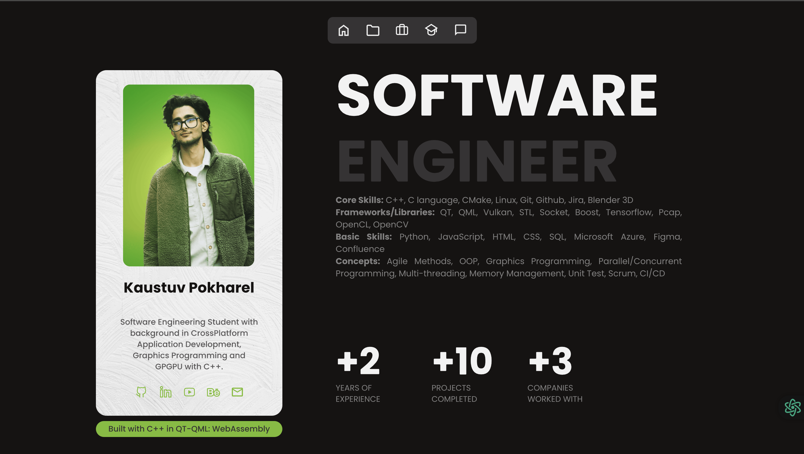

# Portfolio Website - Built with Qt/QML/C++

This is a portfolio website built using Qt, QML, and C++ and deployed via WebAssembly. A year ago, I had an idea of creating my website using C++, but I didn't know how. I was unfamiliar with Qt or the necessary tools, knowing only the basics of C++. Now, a year later, I have successfully completed the first version of my website.

## Preview

### Click the Image to Visit Website 👇
[((http://www.kaustuvpokharel.com)]

## Features

- **Smooth Design**: Despite being built as a QtQuick application, the design maintains a smooth and seamless user experience, resembling a standard website.
- **PDF Resume Viewer**: Visitors can view and download my resume directly in PDF format.
- **WebAssembly Deployment**: The website is built using WebAssembly, allowing it to run efficiently in a browser.

## Getting Started

### Prerequisites

- **Qt SDK**: Ensure you have the necessary Qt development environment installed. You can download it from [Qt's official website](https://www.qt.io/download).
- **Qt Version**: Requires **Qt 6.6.3** or newer (Qt 5 is not supported).
- **Emscripten**: Required for WebAssembly deployment. Install it from [Emscripten's official site](https://emscripten.org/docs/getting_started/downloads.html).

### Cloning the Repository

To get the source files, clone the repository:

```sh
 git clone https://github.com/kaustuvpokharel/portfolioWebsite.git
```

### Building and Running Locally

1. Open the project in **Qt Creator**.
2. Configure the **CMake build system**.
3. In the **Projects** section, select the appropriate build kit:
   - **Windows**: _MSVC 2019 64-bit_
   - **MacOS**: _macOS_
   - **Linux**: _Desktop gcc 64-bit_
4. First, test the build on a desktop kit.
5. If the desktop version runs successfully, switch to WebAssembly:
   - Enable WebAssembly support in Qt Creator.
   - Choose either **single-threaded** or **multi-threaded** WebAssembly.
   - Run the project and test it in a browser (localhost).

## Deployment

### WebAssembly Deployment
To deploy the website as a WebAssembly application:
1. Follow the official [Qt for WebAssembly documentation](https://doc.qt.io/qt-6/wasm.html).
2. Ensure you have **Emscripten** installed and properly configured.
3. Build the WebAssembly version of the project and deploy it to a web server.

### Live Preview
The latest version of the website can be accessed at:  
[Website Link](http://www.kaustuvpokharel.com)

## Customization
You are free to modify and enhance the content, styles, and structure to better suit your personal branding and identity.

## Technologies Used
- **Qt** (C++)
- **QML**
- **Qt WebAssembly**

## Acknowledgments
Special thanks to the **Qt Group** for their excellent documentation and to the **Qt Reddit Community** for their valuable insights.

## Contact
For inquiries or feedback, reach me at: **kastuvpokharel@gmail.com**

---
Happy coding!
